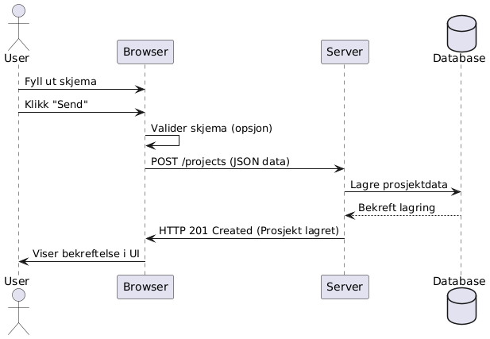

Wireframe ligger under diagrams sammen med sekvensskjemaene. Det er litt forkjell fra wireframen til det ferdige produktet. Jeg endret til farger jeg likte bedre og endret litt på utsene.

 

 

 

 

